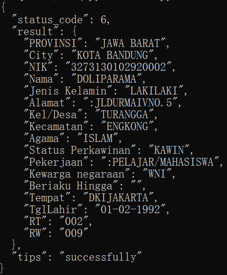

English | [简体中文](README_ch.md)

<p align="center">
 
<p align="center">


------------------------------------------------------------------------------------------

<p align="left">
    <a href=""></a>
    <a href=""></a>
    <a href=""></a>
    <a href=""></a>
</p>

## 简介

OcrServer 实现了针对印尼身份证识别并抽取结构化信息。基于flask+nginx+gunicorn， 完成OcrServer在线服务API接口，吞吐量每日可达86000张图片。服务端内部基于redis+mysql多级缓存持久化识别记录。

**Recent updates**

- API接口可基于base64加密图片传输
- API接口可基于rsa加密身份证图片url传输

## 特征

- OcrServer 基于paddlepaddleOcr实现，具有其一系列优点
  - 支持多种ocr相关前沿算法
- 可运行于linux、windows等多种系统

## FaceSearch 系列模型

| 模型                             | 简介                  | 下载地址          |
| -------------------------------- | --------------------- | ----------------- |
| ch_ppocr_mobile_v2.0_cls_infer   | paddlepaddleocr预训练 | 见paddlepaddleOcr |
| ch_ppocr_mobile_v2.0_cls_infer_1 | 微调                  |                   |
| ch_ppocr_server_v2.0_det_infer   | paddlepaddleocr预训练 | 见paddlepaddleOcr |
| ch_ppocr_server_v2.0_rec_infer   | paddlepaddleocr预训练 | 见paddlepaddleOcr |
| ch_PP-OCRv2_det_infer            | paddlepaddleocr预训练 | 见paddlepaddleOcr |
| ch_PP-OCRv2_rec_infer            | paddlepaddleocr预训练 | 见paddlepaddleOcr |
| det                              | 基于印尼数据集微调    | 联系作者          |
| res                              | 基于印尼数据集微调    | 联系作者          |

## 文档教程

- 运行环境准备  (见[FaceSearch环境准备](https://github.com/ficherfisher/FaceSearch/blob/master/doc/environment.md))
- [API使用](https://gitee.com/deepminer/api-services)
- OcrServer详解
  - [Ocr](./doc/Ocr.md)
  - [服务器API](./doc/flask_nginx_gunicorn.md)
  - [多级缓存持久化](./doc/redis_mysql.md)
- [联系作者](yupengxiong87@gmail.com)

## 效果展示

<div align="center">
    <h5>身份证</h5>
    
    <br>
    <h5>返回结果示例</h5>
    
</div>


```json
{
  "status_code": 6,
  "result": {
    "PROVINSI": "JAWA BARAT",
    "City": "KOTA BANDUNG",
    "NIK": "3273130102920002",
    "Nama": "DOLIPARAMA",
    "Jenis Kelamin": "LAKILAKI",
    "Alamat": ":JLDURMAIVNO.5",
    "Kel/Desa": "TURANGGA",
    "Kecamatan": "ENGKONG",
    "Agama": "ISLAM",
    "Status Perkawinan": "KAWIN",
    "Pekerjaan": ":PELAJAR/MAHASISWA",
    "Kewarga negaraan": "WNI",
    "Beriaku Hingga": "",
    "Tempat": "DKIJAKARTA",
    "TglLahir": "01-02-1992",
    "RT": "002",
    "RW": "009"
  },
  "tips": "successfully"
}

```


